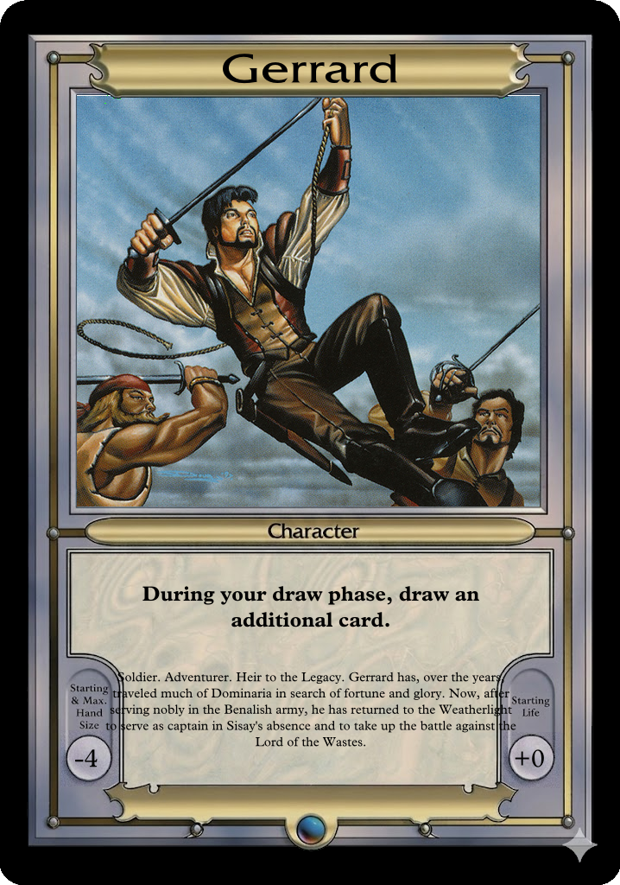
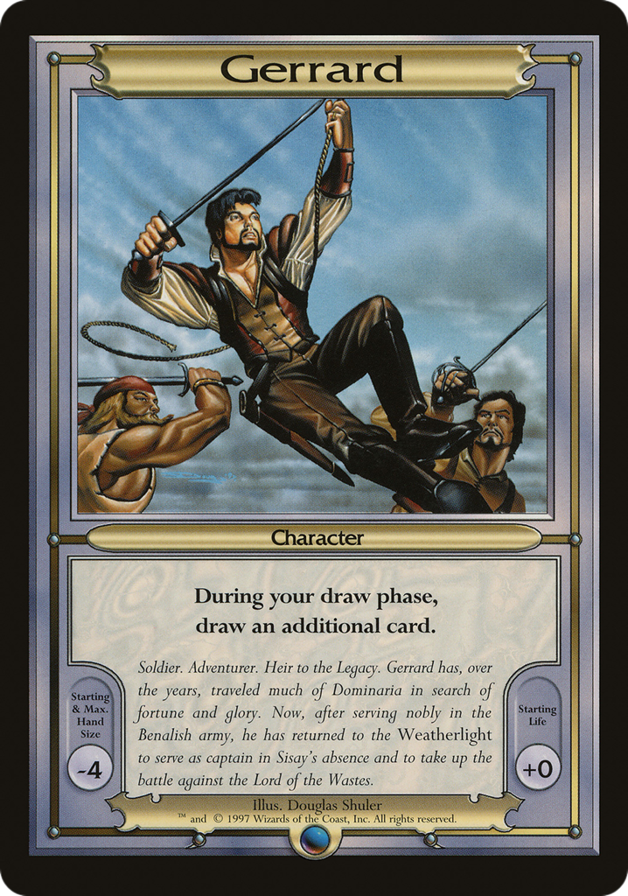
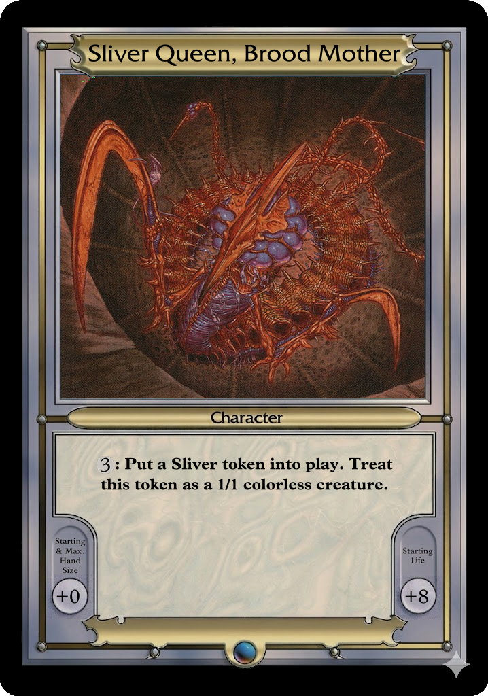
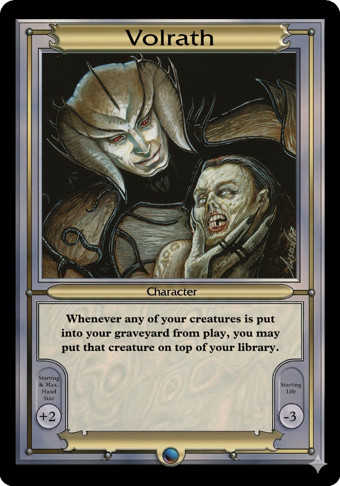
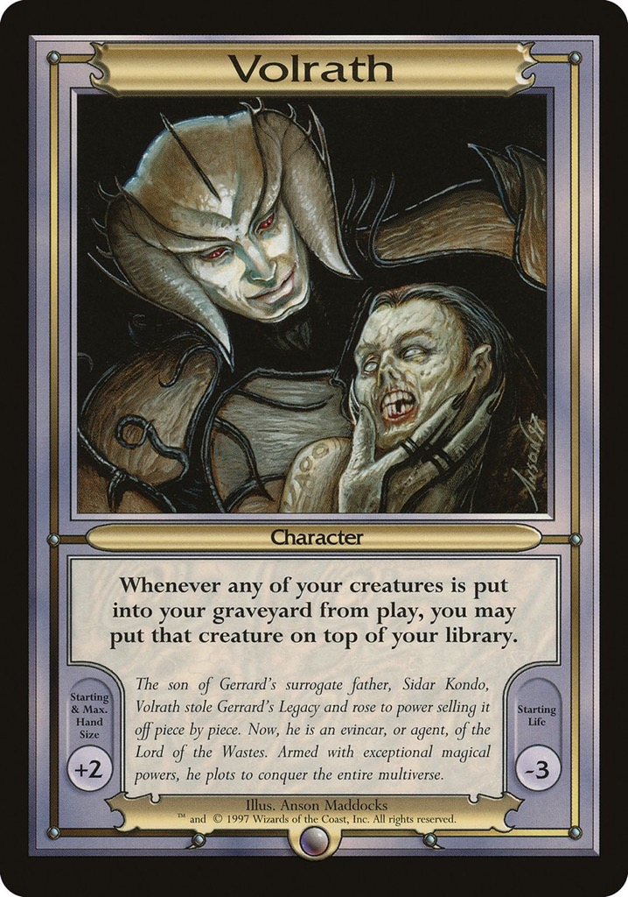

# vgc — Vanguard Creator

A command-line tool for creating custom Magic: The Gathering Vanguard cards. Define cards in YAML, provide artwork, and `vgc` composites them onto an authentic card template with proper typography, mana symbols, and print-ready output.

## Usage
Create a vanguard specification file in YAML (gerrard.yaml).
```yaml
name: "Gerrard"
ability: "During your draw phase, draw an additional card."
flavor: "Soldier. Adventurer. Heir to the Legacy. Gerrard has, over the years, traveled much of Dominaria in search of fortune and glory. Now, after serving nobly in the Benalish army, he has returned to the Weatherlight to serve as captain in Sisay's absence and to take up the battle against the Lord of the Wastes."
hand: "-4"
life: "+0"
artwork: "assets/artwork/gerrard.png"
```

Render it using vgc:
```shell
vgc create gerrard.yaml # will produce ./gerrard.png
```

Which will yield the following result:



See the [Gallery](#gallery) for side-by-side comparisons of rendered vanguards vs. originals.

## Commands

### `vgc create`

Render one or more card definitions into card images.

```
vgc create <path>... [flags]
```

`<path>` can be a YAML file or a directory (all `.yaml` files inside will be rendered).

| Flag | Description |
|---|---|
| `-o, --output <path>` | Output file or directory. Defaults to `<card-name>.png` per card. |
| `--template <file>` | Card template image. Will use embedded image by default. |

### `vgc parse-mse`

Extract cards and artwork from a Magic Set Editor (`.mse-set`) file into individual YAML card definitions.

```
vgc parse-mse <file.mse-set> [flags]
```

| Flag | Description |
|---|---|
| `-o, --output <dir>` | Output directory for YAML files and artwork. Defaults to current directory. |
| `--artwork-dir <name>` | Subdirectory name for extracted artwork. Default: `artwork`. |
| `--overwrite` | Overwrite existing files. Default: skip if YAML already exists. |

### `vgc print`

Arrange card images into a multi-page, print-ready PDF.

```
vgc print <images>... [flags]
```

Accepts card images via arguments or via stdin (one path per line).

| Flag | Description |
|---|---|
| `-o, --output <file>` | Output PDF path. Default: `print.pdf`. |
| `--page-size <size>` | Page format: `a4` or `letter`. Default: `a4`. |
| `--grid <cols>x<rows>` | Cards per page. Default: `3x3`. |
| `--margin <mm>` | Page margin in millimeters. Default: `10`. |
| `--cut-lines` | Draw cut lines between cards. |
| `--stdin` | Read image paths from stdin instead of arguments. |

### `vgc validate`

Check card definitions for errors without rendering.

```
vgc validate <path>...
```

Reports missing fields, unresolvable artwork paths, and unknown mana symbols.

## Card Definition Format

Each card is a single YAML file:

```yaml
name: "Goblin King"
ability: |-
  Other Goblin creatures get +1/+1.
  {R}: Target Goblin gains haste until end of turn.
hand: "-1"
life: "+3"
artwork: "artwork/goblin-king.png"
```

| Field | Required | Description |
|---|---|---|
| `name` | yes | Card name displayed in the title banner. |
| `ability` | yes | Rules text. Supports `{X}` mana notation and paragraph breaks via newlines. |
| `hand` | yes | Starting hand size modifier (e.g. `+1`, `-2`, `+0`). |
| `life` | yes | Starting life modifier. |
| `artwork` | yes | Path to artwork image, resolved relative to the YAML file. |

### Mana Symbols

Use `{X}` notation in ability text. Supported symbols:

- Colored mana: `{W}` `{U}` `{B}` `{R}` `{G}`
- Generic mana: `{1}` `{2}` `{3}` `{4}`
- Special: `{X}` `{T}` (tap)

Symbols are rendered inline at the correct size and baseline.

### Paragraph Breaks

Separate distinct abilities with a newline in the YAML. Use `|-` (literal block scalar) for multi-paragraph text:

```yaml
ability: |-
  First ability text.
  {2}{G}: Second ability text.
```

This produces a visible gap between the two ability blocks on the rendered card.

## Assets

All required assets — card template, fonts (Fremont Regular, MPlantin), and mana symbol PNGs — are bundled into the binary. No installation step or external asset directory is needed. Pass `--template <file>` to `vgc render` to override the embedded template with a custom one.

## Gallery

Side-by-side comparisons of `vgc`-rendered cards (left) versus original Wizards prints (right).

### Gerrard
| Rendered | Original |
|:---:|:---:|
|  |  |

### Sliver Queen, Brood Mother
| Rendered | Original |
|:---:|:---:|
|  |  |

### Volrath
| Rendered | Original |
|:---:|:---:|
|  |  |

## Examples

```shell
# Parse an MSE deck, render all cards, and produce a print PDF
vgc parse-mse deck.mse-set -o cards/
vgc create cards/ -o renders/
vgc print renders/*.png -o deck-print.pdf --cut-lines

# Re-render a single card after editing its YAML
vgc create cards/goblin-king.yaml -o renders/goblin-king.png

# Validate all cards before rendering
vgc validate cards/

# Use a custom template instead of the embedded one
vgc create gerrard.yaml --template my-template.png
```

## License

MIT
