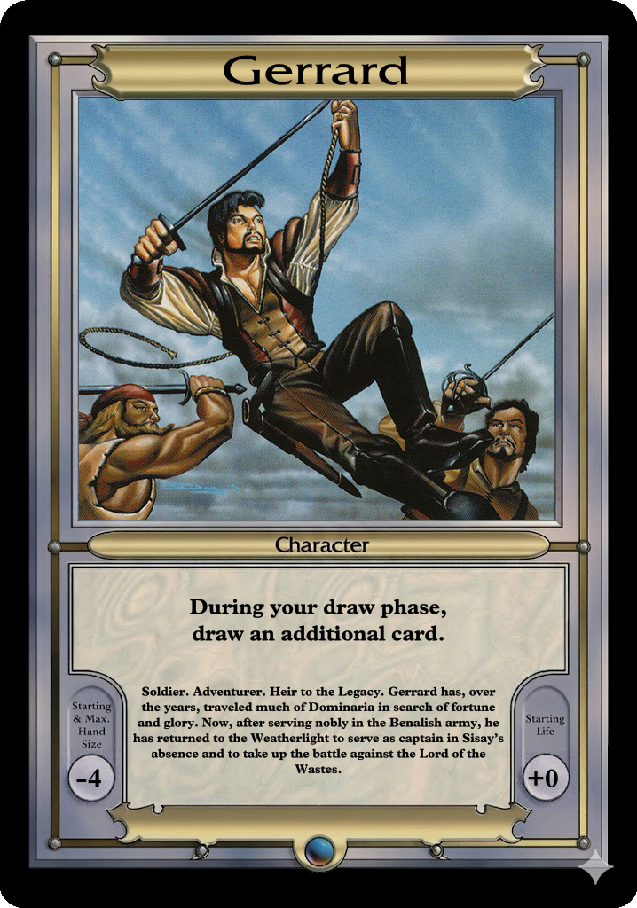
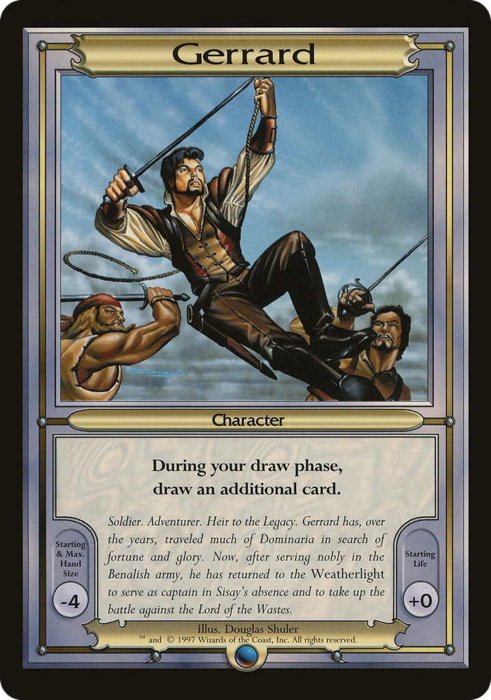
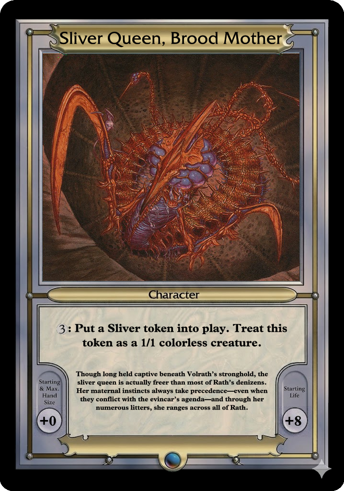
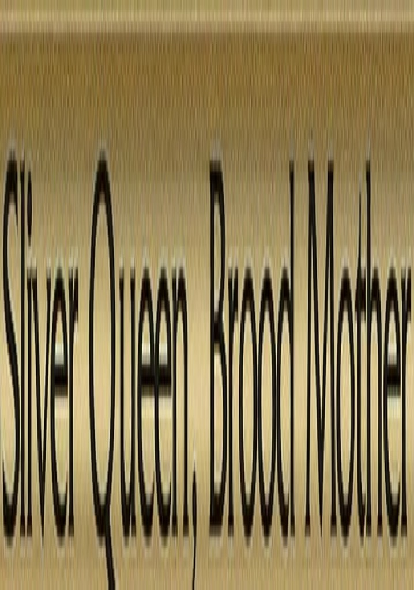
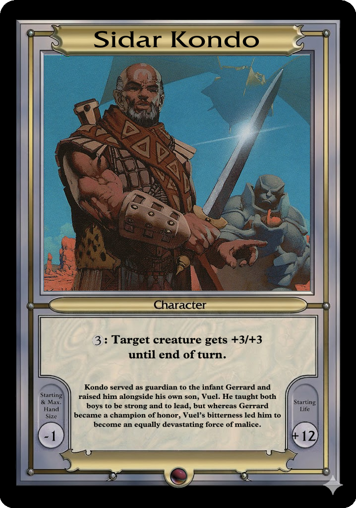
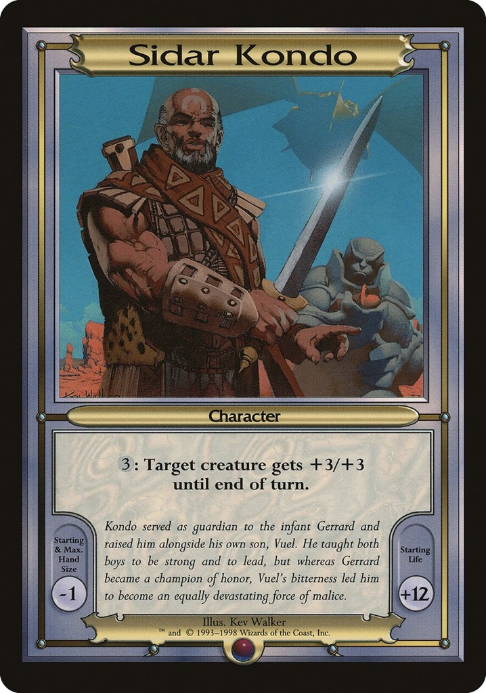
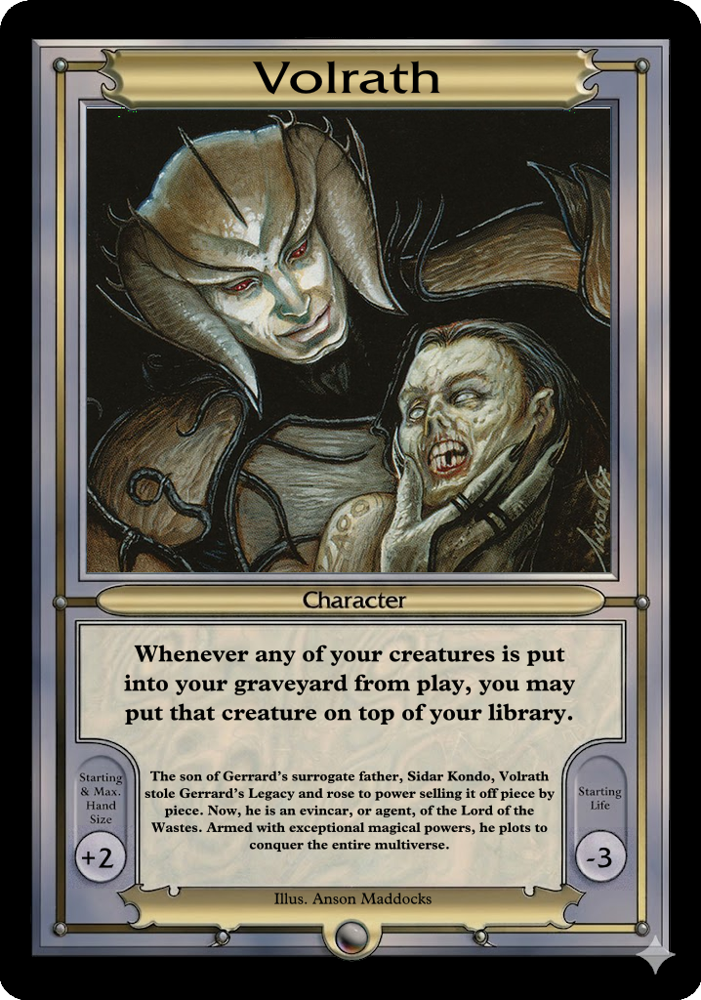
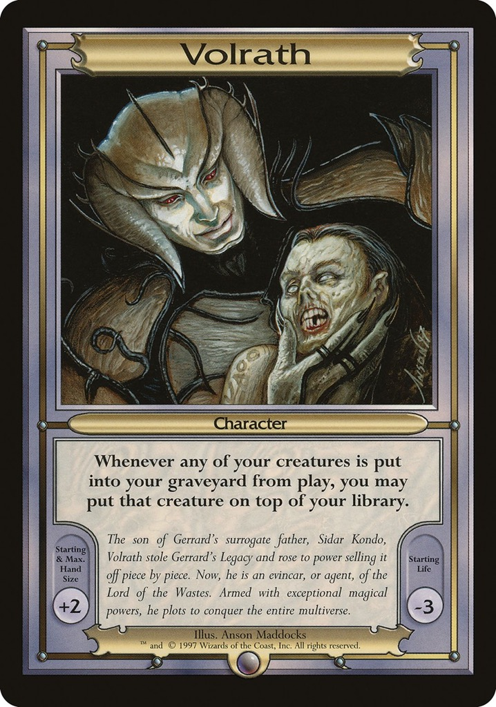

# vgc — Vanguard Creator

A command-line tool for creating custom Magic: The Gathering Vanguard cards. Define cards in YAML, provide artwork, and `vgc` composites them onto an authentic card template with proper typography, mana symbols, and print-ready output.

## Usage
Create a vanguard specification file in YAML (gerrard.yaml).
```yaml
name: "Gerrard"
ability: "During your draw phase,\ndraw an additional card."
flavor: "Soldier. Adventurer. Heir to the Legacy. Gerrard has, over the years, traveled much of Dominaria in search of fortune and glory. Now, after serving nobly in the Benalish army, he has returned to the Weatherlight to serve as captain in Sisay's absence and to take up the battle against the Lord of the Wastes."
hand: "-4"
life: "+0"
color: "blue"
artwork: "assets/artwork/gerrard.png"
```

Render it using vgc:
```shell
vgc create gerrard.yaml # will produce ./gerrard.png
```

Which will yield the following result:

<p align="center"></p>

See the [Gallery](#gallery) for side-by-side comparisons of rendered vanguards vs. originals.

## Commands

### `vgc create`

Render one or more card definitions into card images.

```
vgc create <path>... [flags]
```

`<path>` can be a YAML file or a directory (all `.yaml` files inside will be rendered).

| Flag | Description |
|---|---|
| `-o, --output <path>` | Output file or directory. Defaults to `<card-name>.png` per card. |
| `--template <file>` | Card template image. Will use embedded image by default. |

Every rendered image records the `vgc` version that produced it — see [Output Metadata](#output-metadata).

### `vgc parse-mse`

Extract cards and artwork from a Magic Set Editor (`.mse-set`) file into individual YAML card definitions.

```
vgc parse-mse <file.mse-set> [flags]
```

| Flag | Description |
|---|---|
| `-o, --output <dir>` | Output directory for YAML files and artwork. Defaults to current directory. |
| `--artwork-dir <name>` | Subdirectory name for extracted artwork. Default: `artwork`. |
| `--overwrite` | Overwrite existing files. Default: skip if YAML already exists. |

An `.mse-set` carries nothing that says what colour a card's gem is, so every imported card is written as `color: "blue"` with a comment marking it for review. Check it against the card before rendering.

### `vgc print`

Arrange card images into a multi-page, print-ready PDF.

```
vgc print <images>... [flags]
```

Accepts card images via arguments or via stdin (one path per line).

| Flag | Description |
|---|---|
| `-o, --output <file>` | Output PDF path. Default: `print.pdf`. |
| `--page-size <size>` | Page format: `a4` or `letter`. Default: `a4`. |
| `--grid <cols>x<rows>` | Cards per page. Default: `3x3`. |
| `--margin <mm>` | Page margin in millimeters. Default: `10`. |
| `--cut-lines` | Draw cut lines between cards. |
| `--stdin` | Read image paths from stdin instead of arguments. |

### `vgc sync`

Rename YAML files and their artwork files so that each filename matches the card's `name` field, and update the `artwork` path inside each YAML accordingly.

```
vgc sync <path>... [flags]
```

`<path>` can be a YAML file or a directory (all `.yaml` files inside will be considered).

The command first shows a summary of all planned changes, then asks for confirmation before renaming YAML files, followed by a second prompt before renaming artwork files. Pass `-y` to skip both prompts.

| Flag | Description |
|---|---|
| `-y, --yes` | Skip confirmation prompts and apply all changes automatically. |

**Example:**

```shell
# cards/ger.yaml contains name: "Gerrard", artwork: "art/ger.png"
vgc sync cards/
# Plan:
#   YAML renames (1):   cards/ger.yaml -> cards/gerrard.yaml
#   Artwork renames (1): cards/art/ger.png -> cards/art/gerrard.png
```

### `vgc list-missing-artwork`

List all YAML files in the given path(s) that have no `artwork` field or whose artwork file does not exist. Outputs one path per line, suitable for use with `xargs`.

```
vgc list-missing-artwork <path>...
```

**Example:**

```shell
# Open every card that is missing artwork in your editor
vgc list-missing-artwork cards/ | xargs -o $EDITOR
```

### `vgc validate`

Check card definitions for errors without rendering.

```
vgc validate <path>...
```

Reports missing fields, unresolvable artwork paths, unknown gem colours, and unknown mana symbols.

## Card Definition Format

Each card is a single YAML file:

```yaml
name: "Goblin King"
ability: |-
  Other Goblin creatures get +1/+1.
  {R}: Target Goblin gains haste until end of turn.
hand: "-1"
life: "+3"
color: "red"
artwork: "artwork/goblin-king.png"
```

| Field | Required | Description |
|---|---|---|
| `name` | yes | Card name displayed in the title banner. |
| `ability` | yes | Rules text. Supports `{X}` mana notation, paragraph breaks via newlines, and `* ` at the start of a line for a [modal ability](#modal-abilities). |
| `hand` | yes | Starting hand size modifier (e.g. `+1`, `-2`, `+0`). One or two digits. |
| `life` | yes | Starting life modifier (e.g. `+3`, `+12`, `-8`). One or two digits. |
| `color` | yes | Colour of the gem in the bottom bezel: `white`, `blue`, `black`, `red` or `green`, or the Magic letter `w` `u` `b` `r` `g`, in any casing. A pair such as `wu` or `white/blue` grades the two colours into each other across the sphere, left to right. Note this does *not* follow the card's Magic colour identity — Serra's gem is green and Volrath's is white. |
| `artwork` | yes | Path to artwork image, resolved relative to the YAML file. |
| `flavor` | no | Flavor text rendered below the ability text. **Currently poorly implemented — avoid using it until rendering is improved.** |

### Mana Symbols

Use `{…}` notation in ability text. All 84 symbols from the Scryfall symbology API are supported, sourced as SVGs and rasterized inline at the correct size and baseline.

**Colored mana**
`{W}` `{U}` `{B}` `{R}` `{G}`

**Generic / colorless**
`{0}` `{1}` `{2}` … `{20}` `{100}` `{1000000}` `{X}` `{Y}` `{Z}` `{C}` `{S}` `{HALF}`

**Two-color hybrid** (white mana or the other color)
`{W/U}` `{W/B}` `{U/B}` `{U/R}` `{B/R}` `{B/G}` `{R/G}` `{R/W}` `{G/W}` `{G/U}`

**Generic hybrid** (two generic mana or the color)
`{2/W}` `{2/U}` `{2/B}` `{2/R}` `{2/G}`

**Colorless hybrid**
`{C/W}` `{C/U}` `{C/B}` `{C/R}` `{C/G}`

**Phyrexian** (pay life instead)
`{W/P}` `{U/P}` `{B/P}` `{R/P}` `{G/P}` `{C/P}`

**Phyrexian hybrid**
`{W/U/P}` `{W/B/P}` `{U/B/P}` `{U/R/P}` `{B/R/P}` `{B/G/P}` `{R/G/P}` `{R/W/P}` `{G/W/P}` `{G/U/P}`

**Special / other**
`{T}` (tap) `{Q}` (untap) `{E}` (energy) `{P}` (Phyrexian generic) `{PW}` (planeswalker) `{CHAOS}` `{A}` `{TK}` `{H}` `{HW}` `{HR}` `{L}` `{D}` `{INFINITY}`

### Line Breaks and Paragraph Breaks

A single `\n` in ability text is a **hard line break** — the text continues on the next line with normal line spacing, as if word-wrap had broken there. Use this to force a specific break point without adding extra space.

A blank line (`\n\n`) is a **paragraph break** — produces a visible gap between ability blocks. Use `|-` (literal block scalar) in YAML for multi-paragraph text:

```yaml
ability: |-
  First ability text.

  {2}{G}: Second ability text.
```

### Modal Abilities

A line beginning with `* ` is one **mode** of a modal ability. Modes are set as a
bulleted list with a hanging indent, and the line above them automatically gains
the em dash the printed cards put after the mode-choosing clause:

```yaml
ability: |-
  Choose one
  * Target creature gets +2/+0.
  * Destroy target artifact.
```

renders as

```
                Choose one —
             • Target creature gets +2/+0.
             • Destroy target artifact.
```

The triggered case is the same construct — only the introducing line differs, and
the dash lands wherever that line ends:

```yaml
ability: |-
  At the beginning of your upkeep, choose one
  * Put a +1/+1 counter on each Sliver you control.
  * Draw a card, then discard a card.
  * You gain 2 life.
```

Anything can introduce a list this way — `Choose two`, `choose one or both`,
`Choose one. If you control a Sliver, choose both instead` — in any casing,
because the introducing line is never parsed. Nothing is a keyword: the dash
follows from the modes below it. That also means the count is not checked, so
`choose two` over a list of two modes renders happily; that is yours to get
right.

Points worth knowing when writing modes:

- **Type the text exactly as it should read.** Nothing is added but the dash — a
  mode with no full stop renders without one, and an `—` you write yourself is
  left alone rather than doubled.
- A mode too long for one line wraps under its own text, not under its bullet,
  and only its first line is bulleted.
- A modal block is set flush left as a unit and that unit is centered, so the
  bullets stay in one column even when the list runs past line 3 into the
  narrower space between the stat bubbles.
- Long lists are fine: a block that will not fit is set smaller, and the bullets
  and indent come down with the type.
- To begin a line with a literal asterisk, escape it: `\*`.

## Assets

All required assets — card template, fonts (Fremont Regular, MPlantin), and mana symbol PNGs — are bundled into the binary. No installation step or external asset directory is needed. Pass `--template <file>` to `vgc render` to override the embedded template with a custom one.

## Output Metadata

Every image `vgc` writes records the version of the tool that produced it, so a card file found later can be traced back to the exact release that rendered it. The value is `vgc <version>`, e.g. `vgc 0.8.0`.

| Output | Where it is stored |
|---|---|
| PNG | EXIF `Software` (0x0131) in an `eXIf` chunk, plus a `Software` `tEXt` chunk for tools without EXIF support |
| JPEG | EXIF `Software` in an `APP1` segment |
| Print PDF | `/Producer` and `/Creator` in the document info dictionary |

```
$ exiftool -Software Gerrard.png
Software                        : vgc 0.8.0
```

Both `vgc create` and `vgc print` write raster output this way. Any other format has no metadata container we rely on, so it is written without the tag rather than failing.

## Gallery

Side-by-side comparisons of `vgc`-rendered cards (left) versus original Wizards prints (right).

### Gerrard
| Rendered | Original |
|:---:|:---:|
|  |  |

### Sliver Queen, Brood Mother
| Rendered | Original |
|:---:|:---:|
|  |  |

### Sidar Kondo
| Rendered | Original |
|:---:|:---:|
|  |  |

### Volrath
| Rendered | Original |
|:---:|:---:|
|  |  |

## Examples

```shell
# Parse an MSE deck, render all cards, and produce a print PDF
vgc parse-mse deck.mse-set -o cards/
vgc create cards/ -o renders/
vgc print renders/*.png -o deck-print.pdf --cut-lines

# Re-render a single card after editing its YAML
vgc create cards/goblin-king.yaml -o renders/goblin-king.png

# Validate all cards before rendering
vgc validate cards/

# Use a custom template instead of the embedded one
vgc create gerrard.yaml --template my-template.png
```

## License

MIT
